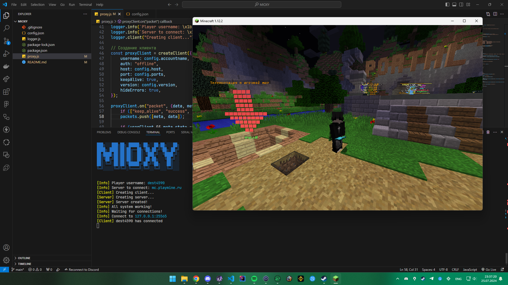

## Description

    Mioxy позволяет возможным заходить на один и тот же сервер, на один и тот же аккаунт,
    НО с разных игровых сессий.

## FAQ

#### Где это можно использовать?

Например, спрятать софт на проверке через виртуальную машину, либо другое устройство

## Скриншоты

## Установка и использование

Cкачиваем архив в любую удобную для нас папку.

Далее, открываем терминал в этой папке и прописываем:

    npm install

Это установит дополнительные зависимости, которые потребуются для корректной работы программы
Теперь, запускаем программу:
    node proxy.js

Финальным шагом будет заполнить конфиг: config.json

    accountname: название аккаунта (юзернейм)
    host: сервер на котором вы будете играть
    proxyhost: на каком адресе будет работать прокси
    port: порт на котором будет работать прокси
    version: версия на которой будете играть

## 🔗 Links

[Recode author github](https://github.com/dest4590)